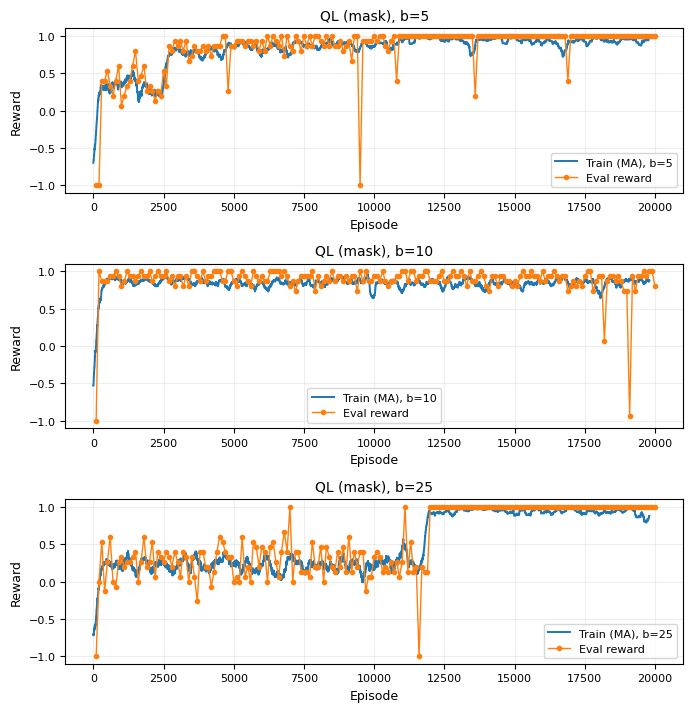
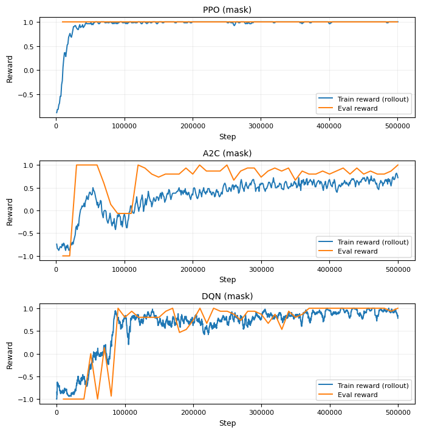

# PvPoke-RL: Deep Reinforcement Learning for Imperfect Information Games

> **"Deep Reinforcement Learning for Robust Policy Optimization in Imperfect Information Games"**
> Manuscript submitted for peer review — WITCOM 2026 · CIC-IPN · Mexico City

[](https://python.org)
[](https://gymnasium.farama.org)
[](https://docker.com)
[](LICENSE)

---

## Overview

This repository provides a **Gymnasium-compatible reinforcement learning environment** built on top of the [PvPoke](https://pvpoke.com) Pokémon GO battle simulator. The environment is formally modeled as a **Partially Observable Markov Decision Process (POMDP)**, providing a tractable yet strategically rich benchmark for evaluating DRL algorithms under partial observability and adversarial dynamics.

The system bridges a JavaScript/PHP battle simulator with a Python DRL ecosystem through a **FastAPI WebSocket broker**, orchestrated with Docker Compose for one-command reproducible setup.

---

## Key Features

- **1v1 and 3v3 battle formats** — configurable via `battle_format` parameter.
- **Two observation modes** — `full` (rich state with move data, types, dex) and `minimal` (compact HP/energy only).
- **Two preprocessing modes** — `normalized` (continuous `[0,1]`) and `discrete` (bucketed bins for tabular methods).
- **Action masking** — three independent implementations per algorithm, preventing illegal actions during training:
  - **PPO** → `ActionMasker` from `sb3_contrib` (native integration)
  - **DQN** → custom `MaskedDQN` with masked Q-values in the training loop and masked exploration
  - **A2C** → custom `MaskedA2CPolicy` with masking directly on actor logits
- **Fog of war** — enemy move power and energy are hidden from the agent; only type and cooldown are observable, faithfully modeling POMDP partial observability.
- **TensorBoard support** — training metrics logged automatically for all algorithms.
- **CLI-configurable training** — all hyperparameters configurable via command-line arguments.

---

## System Architecture

```
┌─────────────────────────┐          ┌─────────────────────────┐          ┌──────────────────┐
│  Python RL Agent        │          │  FastAPI WebSocket       │          │  PvPoke (JS/PHP) │
│  training script        │◄────────►│  Broker                  │◄────────►│  Simulator       │
│  (local · conda)        │  ws://   │  (Docker · port 8000)    │  ws://   │  (Docker · :80)  │
└─────────────────────────┘          └─────────────────────────┘          └──────────────────┘
   connects as client_id                /ws/{client_id}/                     connects as pvpoke
                                         {target_client_id}
```

The FastAPI server acts as a **message broker**: it does not process game logic. It receives messages from the Python agent and forwards them to the PvPoke JS client, and vice versa. Both sides connect as named WebSocket clients and communicate through the broker.

---

## Baseline Results (1v1, paper experiments)

> Results for 3v3 and random team reset are pending evaluation.

| Algorithm | Win Rate | Convergence | Stability |
|-----------|----------|-------------|-----------|
| Q-Learning (b=5) | 87.5–100% | Fast | Low (sharp drops) |
| Q-Learning (b=25) | **100%** | ~420,000 steps | **Zero variance** |
| DQN | 100% | Moderate | Sensitive to buffer size |
| A2C | ~80% | Slow | Mid-training degradation |
| **PPO** | **100%** | **< 50,000 steps** | High |

---

## Environment Specification

### POMDP Formulation

| Element | Description |
|---------|-------------|
| **Hidden State (S)** | Full simulator state: exact HP, energy, buff/debuff modifiers, cooldown timers for both teams |
| **Observation (Ω)** | Partial view — see Observation Space below |
| **Discount Factor (γ)** | 0.99 |

### Action Space

| Action | Code | 1v1 | 3v3 |
|--------|------|-----|-----|
| Fast Attack | 0 | ✓ | ✓ |
| Charged Attack 1 | 1 | ✓ | ✓ |
| Charged Attack 2 | 2 | ✓ | ✓ |
| Shield | 3 | ✓ | ✓ |
| No Shield | 4 | ✓ | ✓ |
| Switch to Pokémon 2 | 5 | ✗ | ✓ |
| Switch to Pokémon 3 | 6 | ✗ | ✓ |

### Observation Space

**`full` mode** — per Pokémon:
- HP (normalized), energy (normalized), dex ID (normalized)
- Type 1 and Type 2 as 18-dimensional one-hot vectors
- **Ally only:** fast move (type + power + energy gain + cooldown), 2× charged moves (type + power + energy)
- **Enemy only (fog of war):** fast move (type + cooldown only), 2× charged (type only)
- Shields remaining; in 3v3: active Pokémon one-hot + remaining Pokémon count

**`minimal` mode** — compact:
- HP and energy per Pokémon (both teams)
- Shields remaining (both teams)

### Reward Function

```
r = +1   win or draw
r = -1   loss
r =  0   otherwise  (sparse — prevents reward hacking)
```

---

## Quickstart

### Prerequisites

- [Docker Desktop](https://www.docker.com/products/docker-desktop/) running
- Python 3.10+ with conda or venv

### Step 1 — Start the simulation infrastructure

```bash
git clone https://github.com/SamuelValdepinoMojica/pvpoke.git
cd pvpoke/docker
docker compose up -d
```

Verify both containers are healthy:

```bash
docker compose ps
# pvpoke                  Up (healthy)   →  http://localhost:80
# pvpoke-fastapi-prod     Up             →  ws://localhost:8000/ws
```

### Step 2 — Configure teams via the PvPoke web interface

> **This step is required before training.** Teams are not configured in code — they are set through the PvPoke GUI.

1. Open `http://localhost/pvpoke/src/train/` in your browser.
2. Navigate to the battle simulator section.
3. Select the Pokémon teams for both players.
4. The simulator will retain the team configuration for the training session.

### Step 3 — Set up your local Python environment

```bash
conda create -n pvpoke-rl python=3.10
conda activate pvpoke-rl
pip install -r PVPOKE/environment/requirements.txt
```

### Step 4 — Train an agent

All training scripts accept CLI arguments. Run with `--help` to see all options.

```bash
# PPO — recommended, fastest convergence (uses MaskablePPO + ActionMasker)
python scripts/train_ppo.py --battle-format 1v1 --total-timesteps 500000

# DQN — custom masked Q-values in training loop
python scripts/train_dqn.py --battle-format 1v1 --total-timesteps 500000

# A2C — custom masked actor logits
python scripts/train_a2c.py --battle-format 1v1 --total-timesteps 500000

# Tabular Q-Learning — discrete observation mode
python scripts/train_qlearning.py --battle-format 1v1 --bins 25 --train-episodes 20000
```

Models and TensorBoard logs are saved to `PVPOKE/outputs/{algo}/{run-name}/`.

### Step 5 — Monitor training with TensorBoard

```bash
tensorboard --logdir PVPOKE/outputs/ppo/ppo_run/logs
```

### Step 6 — Evaluate a trained agent

```bash
# Evaluate PPO model
python scripts/play.py --algo ppo --model-path PVPOKE/outputs/ppo/ppo_run/models/ppo_final_model.zip --episodes 30

# Evaluate DQN model
python scripts/play.py --algo dqn --model-path PVPOKE/outputs/dqn/dqn_run/models/dqn_final_model.zip --episodes 30

# Evaluate A2C model
python scripts/play.py --algo a2c --model-path PVPOKE/outputs/a2c/a2c_run/models/a2c_final_model.zip --episodes 30
```

---

## Training Script Arguments

All scripts share these common arguments:

| Argument | Default | Description |
|----------|---------|-------------|
| `--ws-uri` | `ws://localhost:8000/ws` | WebSocket URI |
| `--battle-format` | `1v1` | `1v1` or `3v3` |
| `--observation-mode` | `minimal` | `minimal` or `full` |
| `--total-timesteps` | `500000` | Total training steps |
| `--run-name` | `{algo}_run` | Experiment name for output folder |
| `--output-dir` | `PVPOKE/outputs/{algo}` | Base output directory |
| `--n-evals` | `5` | Number of intermediate evaluations |
| `--eval-episodes` | `10` | Episodes per evaluation |

Q-Learning specific:

| Argument | Default | Description |
|----------|---------|-------------|
| `--bins` | `10` | Discretization bins (b) |
| `--train-episodes` | `2000` | Training episodes |
| `--alpha` | `0.1` | Learning rate |
| `--epsilon-decay` | `0.99` | Epsilon decay per episode |
| `--use-mask` / `--no-mask` | masked | Enable/disable action masking |

---

## WebSocket Broker

The FastAPI server (`mainSocket.py`) acts as a message broker, not a game engine. It routes messages between two named clients using the URL pattern:

```
ws://localhost:8000/ws/{client_id}/{target_client_id}
```

Both the Python agent and the PvPoke JS simulator connect as named clients and communicate through the broker. The Python agent connects as `rl_0` targeting `pvpoke_0`; the JS client connects as `pvpoke_0` targeting `rl_0`. The `--pair-id` argument in training scripts controls these IDs, enabling multiple parallel sessions.

---

## Repository Structure

```
pvpoke-rl/
├── README.md
├── LICENSE
├── .gitignore
│
├── assets/
│   └── plots/
│       ├── qlearning_granularity_comparison.png
│       └── deep_rl_masked_comparison.png
│   
├── src/                              # PvPoke simulator source (JavaScript/PHP)
│
├── docker/
│   ├── docker-compose.yml
│   ├── Dockerfile.pvpoke
│   ├── Dockerfile.agent-ai
│   └── requirements.api.txt          # FastAPI-only deps (no torch)
│
└── PVPOKE/
    ├── environment/
    │   ├── ClassPVPOKE.py            # Gymnasium wrapper (1v1/3v3, full/minimal, masking)
    │   ├── mainSocket.py             # FastAPI WebSocket broker
    │   └── requirements.txt          # Full training deps
    ├── rl/
    │   ├── masked_dqn.py             # Custom DQN with masked Q-values
    │   ├── masked_a2c.py             # Custom A2C policy with masked logits
    │   └── qlearning.py              # Tabular Q-Learning implementation
    ├── scripts/
    │   ├── train_ppo.py
    │   ├── train_dqn.py
    │   ├── train_a2c.py
    │   ├── train_qlearning.py
    │   └── play.py
    └── outputs/                      # Training logs, checkpoints, TensorBoard
        ├── ppo/
        ├── dqn/
        ├── a2c/
        └── qlearning/
```

---

## Dependencies

| File | Used by | Key packages |
|------|---------|--------------|
| `docker/requirements.api.txt` | FastAPI container | fastapi, uvicorn, websockets |
| `PVPOKE/environment/requirements.txt` | Local training env | gymnasium, torch, stable-baselines3, sb3-contrib |

---

## Research Manuscript (Under Review)

> **"Deep Reinforcement Learning for Robust Policy Optimization in Imperfect Information Games"**
> S. Valdespino-Mojica, R. Menchaca-Méndez, R. Menchaca-Méndez
> Submitted to WITCOM 2026 — Centro de Investigación en Computación (CIC-IPN)

## Training Curves

### Tabular Q-Learning — Effect of state granularity


### Deep RL with Action Masking — PPO, A2C, DQN


---

## Future Work

- **3v3 experimental results** — evaluation of MaskablePPO and MaskedDQN in the full 3v3 format.
- **Random team reset** — training with randomized team compositions per episode for generalization.
- **Self-play training** — co-evolution of strategies beyond a fixed rule-based opponent.
- **Recurrent architectures** — RNN/Transformer for exploiting temporal dependencies in POMDP sequences.
- **Belief-state estimation** — explicit modeling of hidden opponent team composition in 3v3.
- **Environment vectorization** — parallelized episode collection for scalable on-policy algorithms.

---

## Acknowledgments

We thank the **Centro de Investigación en Computación (CIC-IPN)** for infrastructure support, and the [PvPoke](https://pvpoke.com) open-source project for the underlying battle engine.

---

## License

MIT License — see [LICENSE](LICENSE) for details.
This project builds upon [pvpoke/pvpoke](https://github.com/pvpoke/pvpoke) (MIT License).